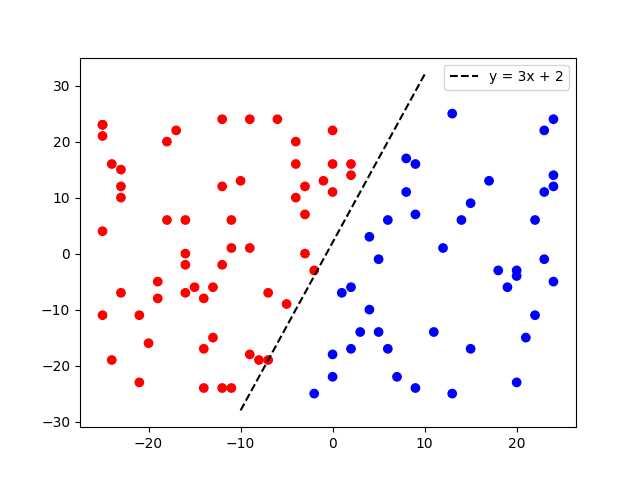

# 1. Perceptron
Perceptron přijímá vstup o n dimenzích. Drží si váhy a bias, podle kterých pak tvoří predikci. 

V kódu jsem nejprve vygeneroval 100 náhodných bodů v rozmezích [-25, 25, int] a dopočítal k nim správné labely. Na těchto hodnotách
jsem Perceptron natrénoval. Následně jsem vygeneroval dalších 100 náhodných bodů, tentokrát bez labelů -- ty predikoval
natrénovaný Perceptron. Po vykreslení těchto bodů a predikcí lze vidět, že Perceptron funguje správně.

Komentáře k fungování jednotlivých metod jsou vždy v záhlaví dané metody, popřípadě na řádcích, pokud
se tam nachází cosi divného.

