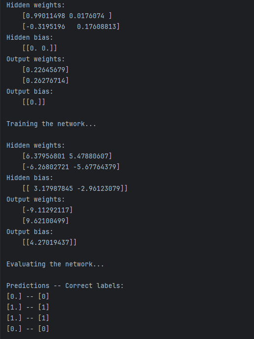

# 2. Xor problem
Pro řešení Xor problému jsem implementoval vlastní neuronovou síť. Ta má 2 neurony ve skryté vrstvě
a 1 neuron ve výstupní vrstvě. Jako aktivační funkci jsem použil Sigmoid. Při trénování nejprve probíhá
forward propagace (np.dot vstupů a vah + bias), následně se vypočítá error a dochází k backwards propagaci.

Po natrénování pak síť dává v drtivé většině případů 100% správné výsledky. 

