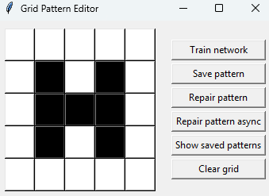

# 3. Hopfield Network
Na implementaci Hopfieldovy sítě byla nejbolestivější tvorba samotného uživatelského rozhraní. 
Samotná Hopfieldova síť byla poměrně intuitivní a dost se podobala Perceptronu / sítím implementovaným
v jiných předmětech -- jediným rozdílem byla možnost volby synchronního (všechny neurony se updatují najednou) / 
asynchronního (neurony se updatují postupně) updatování stavu neuronů.

Při trénování se postupně projdou všechny patterny a na základě Hebbova pravidla (vzorec z přednášky, outer producty, 
vynulování diagonál) se updatují váhy. Vzory se pak obnovují iterativně, dokud se síť neustálí.

Až na výjimky (tvar je malý a příliš narušený) se síť dokáže naučit vzory a následně je asynchronně opravit.
Synchronní oprava většinou též funguje, avšak úspěšnost je nižší (což je očekávatelné).

