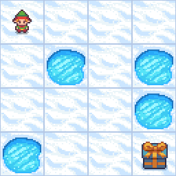

# 4. Q-Learning
Pro řešení tohoto problému jsem implementoval vlastní Q-Learning algoritmus a využil jej pro trénování agenta
na prostředí z knihovny Gymnasium. Agenta jsem trénoval pro hru FrozenLake-v1 v deterministické verzi, která má 4 akce 
a 16 možných stavů. Agent se po pár stovkách epizod natrénoval.

Implementace je trochu rozšířenější než ta z přednášky.
Agent využívá Q-table pro ukládání Q-values (ty říkají, jak dobré je provést konkrétní akci v daném stavu)
a epsilon-greedy rozhodování, kterým řeší exploration vs. exploitation problém. Tradeoff okamžitých vs. 
budoucích odměn je pak řešen pomocí discount factoru gamma. Agent nevyužívá replay memory, protože by to
při klasickém Q-learningu bez neuronových sítí nejspíš nemělo smysl.

Nutno nainstalovat:
- ```gymnasium```
- ```gymnasium[toy_text]```

