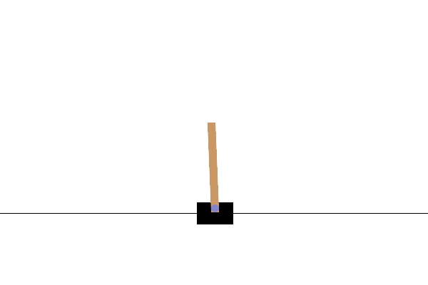

# 5. Pole balancing problem
Na téma Deep Reinforcement Learningu jsem psal bakalářskou práci, takže se implementace tohoto úkolu
sestávala převážně z vyrabování, zjednodušení a refaktorizace kódu této práce ;) Největší změna
spočívala v zjednodušení architektury DQN, jelikož prostředí CartPole nepracuje s obrazovými, ale
vektorovými daty.

Model jsem nechal trénovat 200 epizod, což stačilo na to, aby se agent naučil hrát hru na docela dobré
úrovni (maximální skóré je 500; toho agent občas dosahoval, při testování se však většinou pohyboval okolo 300).

Tak jako v předchozím úkole, agent využívá epsilon-greedy rozhodování a discount factor. Q-table je však
nahrazena dvěma neuronovými sítěmi (stabilní target, optimalizovaná policy) a navíc je přidána replay memory pro
uchovávání předešlých epizod, které agent využívá k učení.

Původní kód lze nalézt zde: [GitHub repozitář](https://github.com/ItsTSV/DeepReinforcementLearning)

Detailní popis Deep Q-Learningu pak zde, v kapitole 3.1: [DSPace](https://dspace.vsb.cz/bitstream/handle/10084/153832/SVO0280_FEI_B0613A140014_2024.pdf?sequence=1&isAllowed=y)

Pro spuštění je nutno mít pytorch, gym a numpy. Protože instalace torche může být trochu pain, přikládám soubor s 
vahami a výsledný gif jakožto důkaz funkčnosti.

