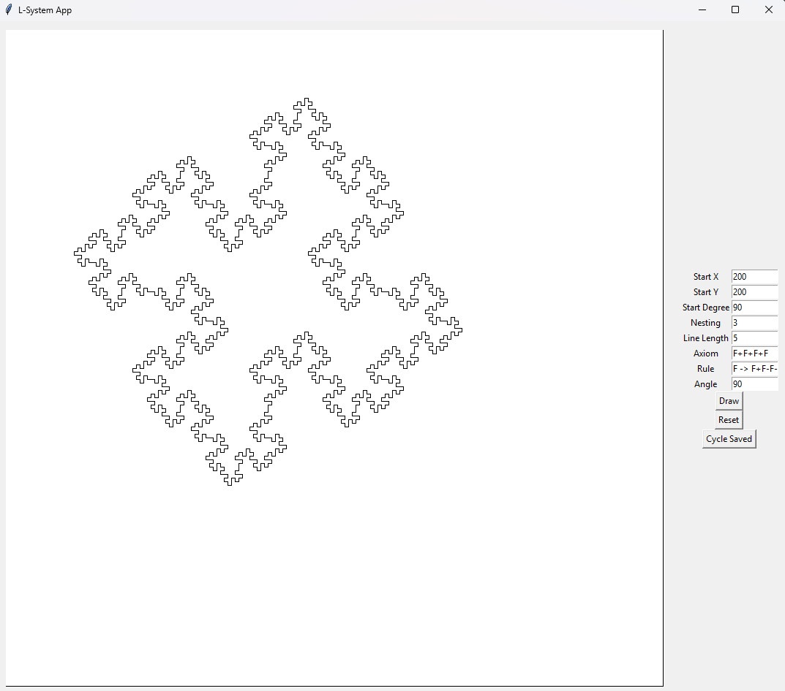

# 6. L-System
Pro generování obrazců pomocí L-systémů jsem vytvořil jednoduchou appku v Tkinteru. Algoritmus generování funguje
na principu pravidel, která se n-krát aplikují na axiom. Výsledný řetězec symbolů je pak cyklicky procházen; 
na základě vybraného symbolu je pak vybrána akce:

- F: pohyb a kreslení
- b: pohyb bez kreslení
- +: otočení doprava
- -: otočení doleva
- \[: push
- \]: pop

Na základě provádění těchto akcí pak vzniká výsledný obrazec. Appka obsahuje možnost vytvořit vlastní
obrazce a několik pre-made obrazců.

