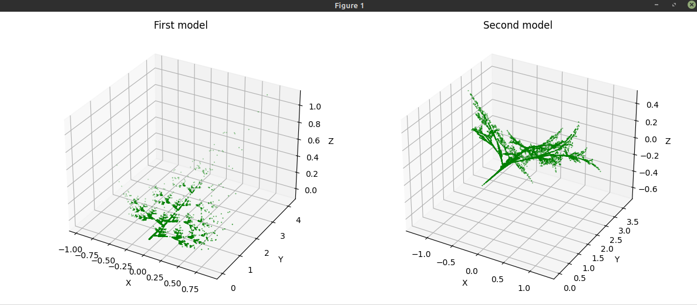

# 7. IFS
IFS funguje na principu opakovaného aplikování náhodně vybrané transformace na vybraný bod. 
Pozice tohoto bodu se stále mění; změny se ukládají. Na základě uložených změn pak lze vykreslit fraktál.

