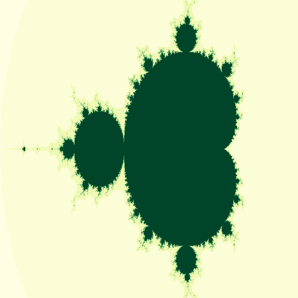
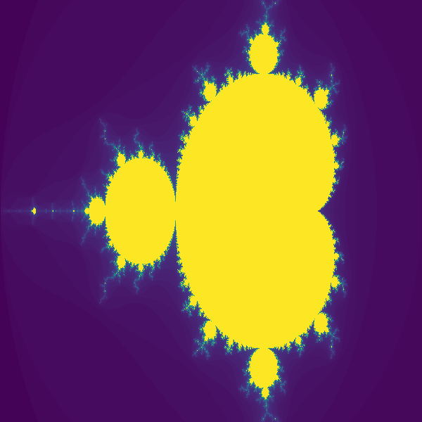
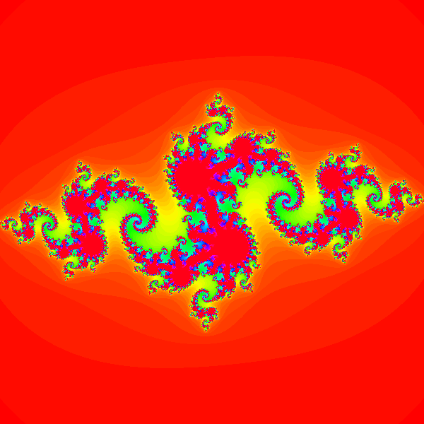

# 8. TEA
Time Escape Algoritmus funguje na principu výpočty hodnoty každého bodu fraktálového prostoru. Opakovaně se počítá 
rovnice a její výsledek se porovnává s danou konstantnou (v mém případě 2). Pokud je výsledek větší než 2, počet iterací
pro daný bod se zaznamená; pokud je výsledek menší, pokračuje se do další iterace, popřípadě algoritmus končí, 
pokud již bylo dosaženo maximálního počtu iterací. Zaznamenaná hodnota se pak použije k určení barvy daného bodu.

Zoomovat je možné levým klikem do obrázku -- fraktál se pak překreslí s hranicemi vycentrovanými okolo vybraného bodu.
Velikost zoomu je určena proměnnou `zoom_factor` v konstruktoru. To samozřejmě může trošku trvat, protože (díkybohu)
programujeme v Pythonu, ne C++.

Též je možné vygenerovat gif s animací zoomu pomocí funkce `generate_gif()`. Počet snímků je určen parametrem `frames`,
velikost zoomu pak výše zmíněným zoom factorem. Místo, na kterém se zoomuje, je určeno `zoom_center`.
Gify se ukládají jako `SETNAME_zoom.gif`. 

Též je možné nastavit libovolnou colormapu z Matplotlibu, ať jsou obrázky více fancy ;)

| Mandelbrot Green Forest | Mandelbrot | Julia |
|-------------------------|------------|-------|
|  |  |  |

