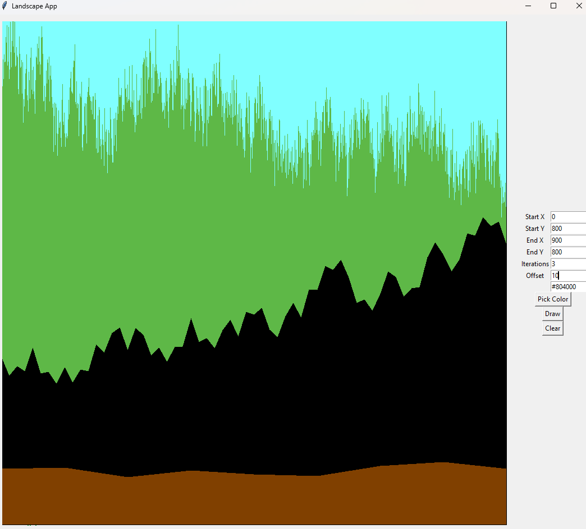
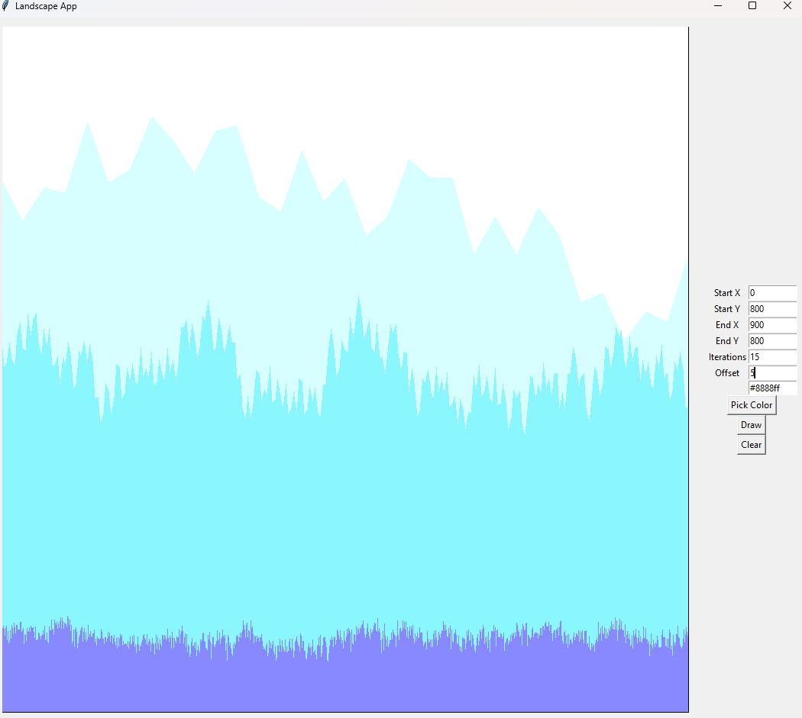
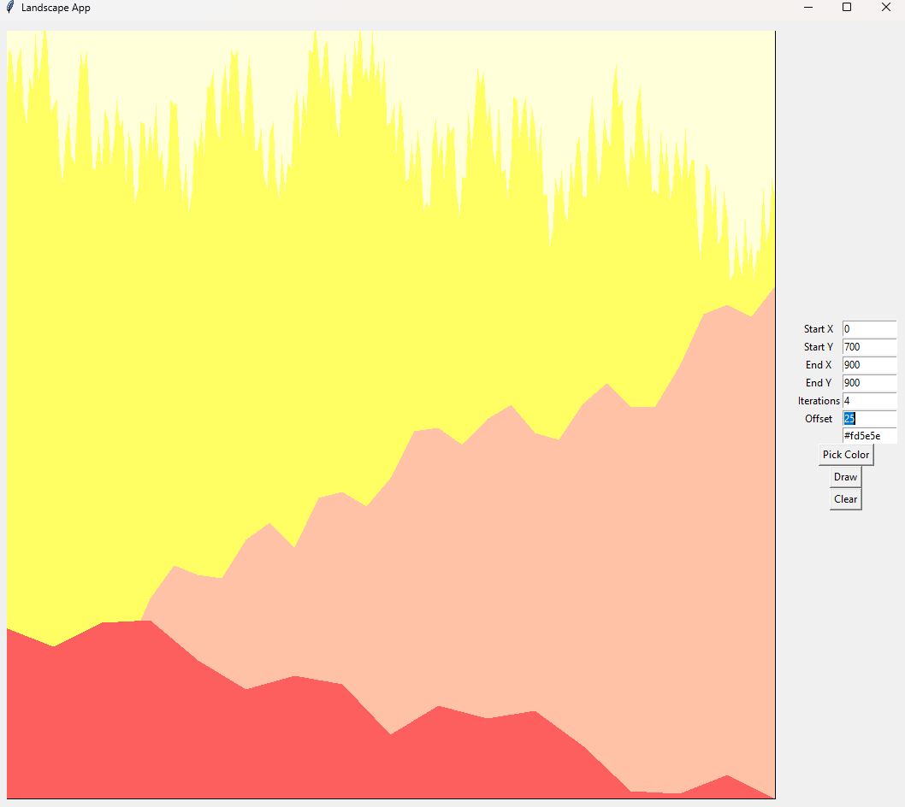

# 9. Generating 2D terrain using fractal geometry
Pro generování 2D terénu jsem vytvořil jednoduchou tkinter aplikaci. Algoritmus, který se používá ke generování, funguje
na principu půlení úsečky -- vybere se bod v půli úsečky, ten je posunut nahoru nebo dolů o vybranou hodnotu; úsečka 
se pak rozdělí a vybraný bod je použit jako začátek jedné a konec druhé části. Takto se postupuje rekurzivně, dokud
nedosáhneme požadovaného počtu iterací. V poslední iteraci se pak vykreslí vytvořené polygony.

Největším problémem bylo zjistit, jak fungují polygony v Tkinteru ;) Nepříliš intuitivní je též osa Y v Tkinteru: 0 
je nahoře, na což je potřeba při nastavování Start Y a End Y myslet.

