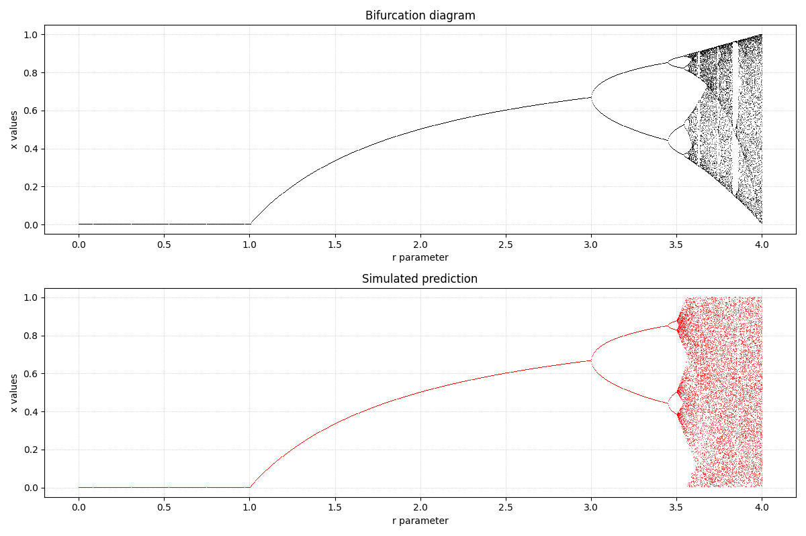

# IX. Theory of Chaos
Tento úkol vizualizuje bifurkační diagram pro logistickou mapu. Bifurkační diagram ukazuje, jak se mění chování
dynamického systému v závislosti na parametru. V tomto případě se jedná o parametr `r`, který ovlivňuje chování logistické mapy.
V rozmezí od 0 do +- 3.5 je systém stabilní. V rozmezí od +- 3.5 do 4 však nastává deterministický chaos.

Reálná predikce by se pak získala pomocí neuronové sítě; v oblasti stabilního chování by byla přesná, kdežto
v oblasti chaosu nepřesná. Já využil možnosti vymyšlení vlastní predikce ("you can just make some prediction"), takže mé hodnoty
jsou pouze simulované.

