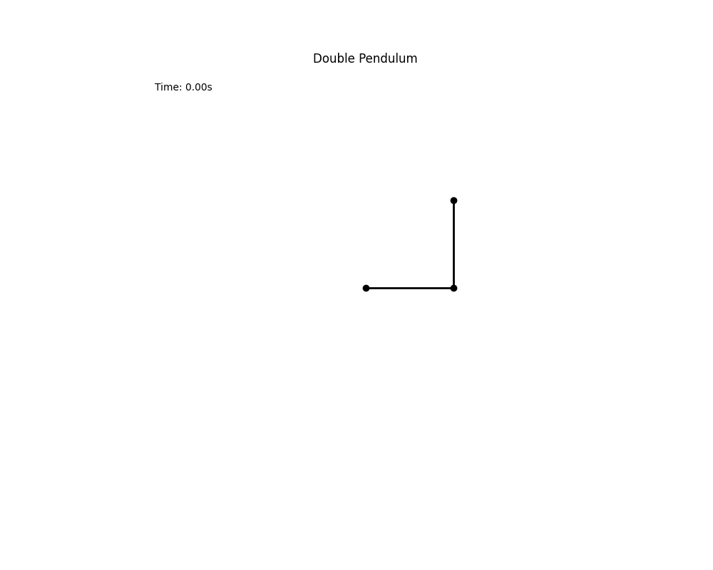

# XI. Double Pendulum
Dvojité kyvadlo je příkladem systému s deterministickým chaosem. Nepřekvapivě se skládá ze dvou ramen a dvou závaží,
které jsou propojeny klouby. U simulace lze nastavit parametry, jako jsou délka ramen, hmotnost závaží, úhly,
gravitační konstanta apod. Samotný pohyb je pak řešen množstvím cursed rovnic, jež jsem si vypůjčil z poskytnuté prezentace.

Pro lepší vizualizace zanechávají obě závaží trajektorii ;)



Zdroje:
```
https://michaelmachu.eu/data/pdf/navy/double_pendulum.pdf
https://scipython.com/blog/the-double-pendulum/
```