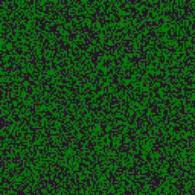

# XII. Forest Fire
Forest FDire je cellular automaton simulující šíření požáru lesem. Každá buňka může mít tři stavy:

0. Prázdné místo
1. Strom
2. Hořící strom

Tyto buňky se následně v každé iteraci aktualizují podle následujících pravidel:

1. Hořící strom se změní na prázdné místo
2. Strom se změní na hořící strom, pokud je v sousedství alespoň jeden hořící strom
3. Strom se může s určitou pravděpodobností může sám vznítit
4. Na prázdném místě může s určitou pravděpodobností vyrůst strom

Program může vykreslovat Forest Fire buď v real time matplotlib módu, nebo uložit simulaci do gifu.

